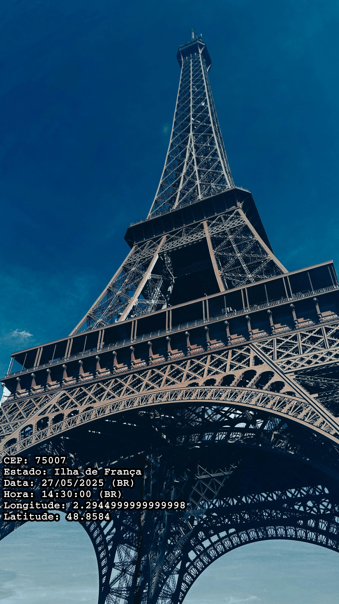
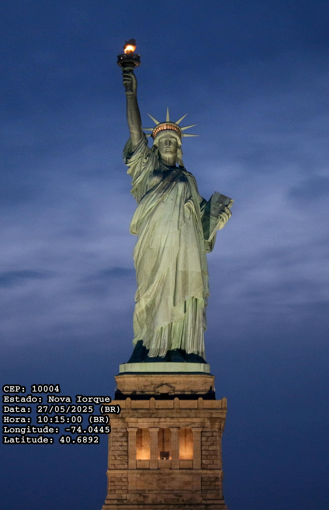

<p align="center">
  
</p>

<h1 align="center">Photo Info Manager</h1>

**Photo Info Manager** é um software com interface gráfica desenvolvido em Python que permite visualizar metadados de imagens (como data, hora, localização GPS etc.). A ferramenta foi criada originalmente para ajudar uma empresa de fiscalização de energia do governo no intuito de agilizar processos e ajudar na organização de arquivamentos.

⚠️ **Aviso importante:**  
Este projeto é demonstrativo e a chave de API originalmente usada (OpenCage Geocoder) expirou.  
O programa exibe **latitude e longitude** mesmo sem chave de API. Para obter **informações adicionais** como CEP e Estado, basta criar um arquivo `.env` com sua própria chave da API.  
**Exemplo do conteúdo do arquivo `.env`:**

```
API_KEY_OPENCAGE=SUA_CHAVE_API
```

Você pode obter sua chave temporária gratuitamente no site [opencagedata.com](https://opencagedata.com/).

Se a imagem não contiver informações como data ou hora nos metadados, o programa exibirá **"Sem dados"** nesses campos.

---

## 🔧 Funcionalidades

- Leitura de metadados de imagens 
- Interface feita com PySide6 
- Efeitos visuais e animações suaves
- Suporte à abertura de pastas e leitura em lote
- Compatível com Windows 10 e 11
- Integração opcional com API OpenCage para conversão de coordenadas GPS

---

<h2>🖼️ Exemplos visuais</h2>

<p>Prints do funcionamento completo com API ativa:</p>

 

---

## 🧠 Sobre o desenvolvimento

Este projeto foi desenvolvido como uma forma de aprendizado prático em Python e construção de interfaces gráficas com PySide6.

Durante o processo, utilizei o **ChatGPT** como ferramenta de apoio técnico. A IA foi usada para:
- Ajudar a estruturar trechos de código
- Sugerir formas de organizar funções
- Resolver erros pontuais
- Criar métodos de integração entre a lógica e a interface `.ui`

Todas as implementações passaram por **curadoria e adaptação pessoal**. O objetivo foi aprender ativamente, entender o funcionamento das ferramentas, e estruturar um projeto funcional de forma progressiva.

Essa abordagem me permitiu focar em entender conceitos e resolver problemas, algo que acredito ser essencial no desenvolvimento moderno.

---

## 🚀 Como executar o projeto

1. Clone o repositório:
   ```bash
   git clone https://github.com/JyanDev/photo-info-manager.git
   cd photo-info-manager
   ```

2. Crie e ative um ambiente virtual:
   ```bash
   python -m venv venv
   # No Windows:
   .\venv\Scripts\activate
   # No Linux/macOS:
   source venv/bin/activate
   ```

3. Instale as dependências:
   ```bash
   pip install -r src/requirements.txt
   ```

4. (Opcional) Crie um arquivo `.env` com sua chave de API:
   ```
   API_KEY_OPENCAGE=sua_chave_aqui
   ```

5. Execute o programa:
   ```bash
   cd src
   python main.py
   ```

---

